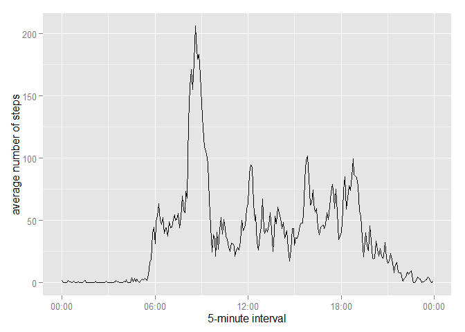

# Reproducible Research: Peer Assessment 1

## Loading and preprocessing the data

Load the data


```r
unzip("activity.zip")
activity <- read.csv("activity.csv")
str(activity)
```

```
## 'data.frame':	17568 obs. of  3 variables:
##  $ steps   : int  NA NA NA NA NA NA NA NA NA NA ...
##  $ date    : Factor w/ 61 levels "2012-10-01","2012-10-02",..: 1 1 1 1 1 1 1 1 1 1 ...
##  $ interval: int  0 5 10 15 20 25 30 35 40 45 ...
```

Process the data into a format suitable for analysis


```r
activity$date <- as.Date(activity$date)
str(activity)
```

```
## 'data.frame':	17568 obs. of  3 variables:
##  $ steps   : int  NA NA NA NA NA NA NA NA NA NA ...
##  $ date    : Date, format: "2012-10-01" "2012-10-01" ...
##  $ interval: int  0 5 10 15 20 25 30 35 40 45 ...
```

## What is mean total number of steps taken per day?

Calculate the total number of steps taken per day


```r
library(dplyr)
```

```
## 
## Attaching package: 'dplyr'
## 
##  以下のオブジェクトは 'package:stats' からマスクされています: 
## 
##      filter, lag 
## 
##  以下のオブジェクトは 'package:base' からマスクされています: 
## 
##      intersect, setdiff, setequal, union
```

```r
activity_per_day <- activity %>% group_by(date) %>% summarize(steps = sum(steps))
str(activity_per_day)
```

```
## Classes 'tbl_df', 'tbl' and 'data.frame':	61 obs. of  2 variables:
##  $ date : Date, format: "2012-10-01" "2012-10-02" ...
##  $ steps: int  NA 126 11352 12116 13294 15420 11015 NA 12811 9900 ...
```

Make a histogram of the total number of steps taken each day


```r
library(ggplot2)
qplot(activity_per_day$steps, xlab = "total number of steps taken per day", binwidth = 1000)
```

 

Calculate the mean and median of the total number of steps taken per day


```r
mean(activity_per_day$steps, na.rm = T)
```

```
## [1] 10766.19
```

```r
median(activity_per_day$steps, na.rm = T)
```

```
## [1] 10765
```

## What is the average daily activity pattern?

Make a time series plot of the 5-minute interval (x-axis) and the average number of steps taken, averaged across all days (y-axis)


```r
t <- as.POSIXlt(activity$date[1])
interval <- seq(t, t + 24 * 60 * 60 - 5 * 60, 5 * 60)
daily_activity <- activity %>% group_by(interval) %>% summarize(steps = mean(steps, na.rm = T))
daily_activity$interval <- interval
library(scales)
qplot(interval, steps, data = daily_activity, geom = "line", 
      xlab = "5-minute interval", ylab = "average number of steps") + 
    scale_x_datetime(labels = date_format("%H:%M"))
```

 

Which 5-minute interval, on average across all the days in the dataset, contains the maximum number of steps?


```r
format(with(daily_activity, interval[which.max(steps)]), "%H:%M")
```

```
## [1] "08:35"
```

## Imputing missing values

Calculate and report the total number of missing values in the dataset


```r
sum(is.na(activity$steps))
```

```
## [1] 2304
```

Use the mean for that 5-minute interval for filling in all of the missing values in the dataset

Create a new dataset that is equal to the original dataset but with the missing data filled in


```r
activity_new <- activity
activity_new$steps[is.na(activity_new$steps)] <- daily_activity$steps
str(activity_new)
```

```
## 'data.frame':	17568 obs. of  3 variables:
##  $ steps   : num  1.717 0.3396 0.1321 0.1509 0.0755 ...
##  $ date    : Date, format: "2012-10-01" "2012-10-01" ...
##  $ interval: int  0 5 10 15 20 25 30 35 40 45 ...
```

Make a histogram of the total number of steps taken each day


```r
activity_per_day_new <- activity_new %>% group_by(date) %>% summarize(steps = sum(steps))
qplot(activity_per_day_new$steps, xlab = "total number of steps taken per day", binwidth = 1000)
```

 

Calculate the mean and median total number of steps taken per day


```r
mean(activity_per_day_new$steps)
```

```
## [1] 10766.19
```

```r
median(activity_per_day_new$steps)
```

```
## [1] 10766.19
```

Do these values differ from the estimates from the first part of the assignment?


```r
mean(activity_per_day$steps, na.rm = T) == mean(activity_per_day_new$steps)
```

```
## [1] TRUE
```

```r
median(activity_per_day$steps, na.rm = T) == median(activity_per_day_new$steps)
```

```
## [1] FALSE
```

## Are there differences in activity patterns between weekdays and weekends?

Create a new factor variable in the dataset with two levels -- "weekday" and "weekend" indicating whether a given date is a weekday or weekend day


```r
Sys.setlocale("LC_TIME","us")
```

```
## [1] "English_United States.1252"
```

```r
weekend <- c("Saturday", "Sunday")
activity_new$day[weekdays(activity_new$date) %in% weekend] <- "weekend"
activity_new$day[!weekdays(activity_new$date) %in% weekend] <- "weekday"
activity_new$day <- factor(activity_new$day)
str(activity_new)
```

```
## 'data.frame':	17568 obs. of  4 variables:
##  $ steps   : num  1.717 0.3396 0.1321 0.1509 0.0755 ...
##  $ date    : Date, format: "2012-10-01" "2012-10-01" ...
##  $ interval: int  0 5 10 15 20 25 30 35 40 45 ...
##  $ day     : Factor w/ 2 levels "weekday","weekend": 1 1 1 1 1 1 1 1 1 1 ...
```

Make a panel plot containing a time series plot of the 5-minute interval (x-axis) and the average number of steps taken, averaged across all weekday days or weekend days (y-axis)


```r
daily_activity_new <- activity_new %>% group_by(day, interval) %>% summarize(steps = mean(steps, na.rm = T))
daily_activity_new$interval <- interval
qplot(interval, steps, data = daily_activity_new, geom = "line", facets = day ~ .,
      xlab = "5-minute interval", ylab = "average number of steps") + 
    scale_x_datetime(labels = date_format("%H:%M"))
```

 
